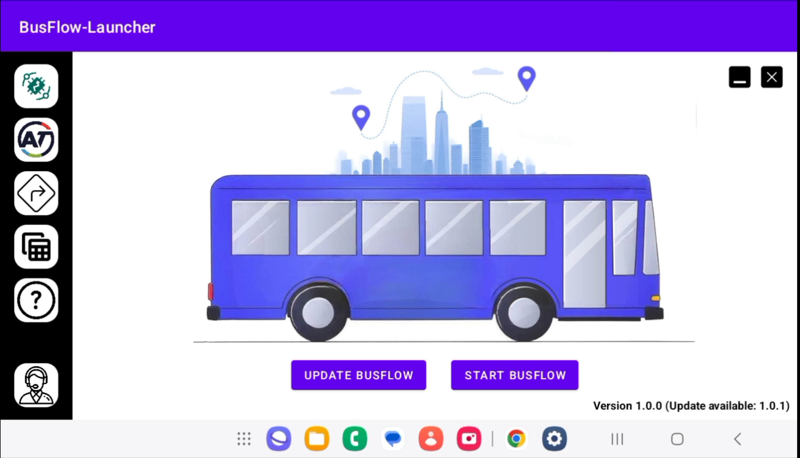
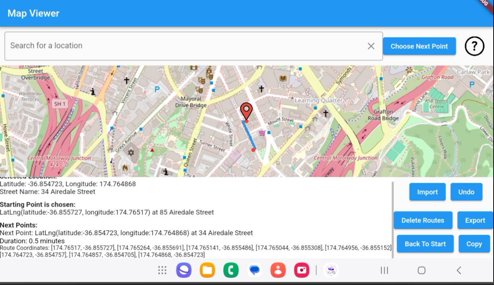
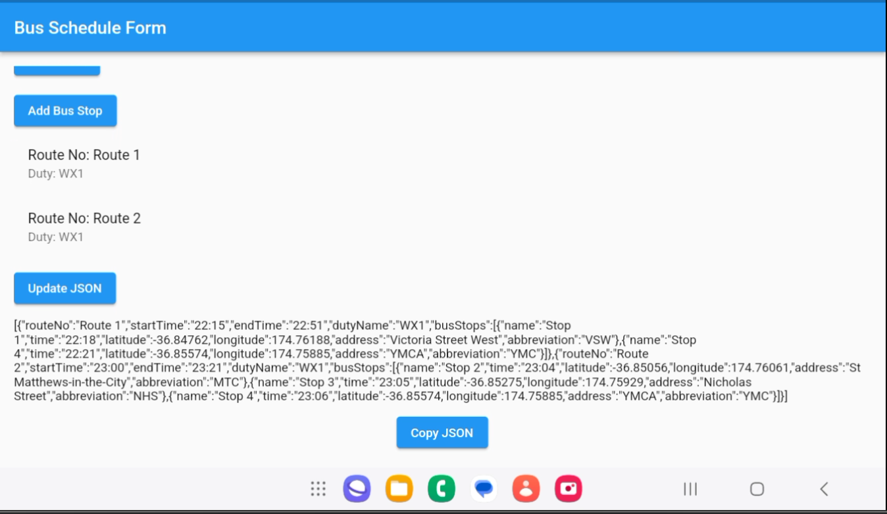
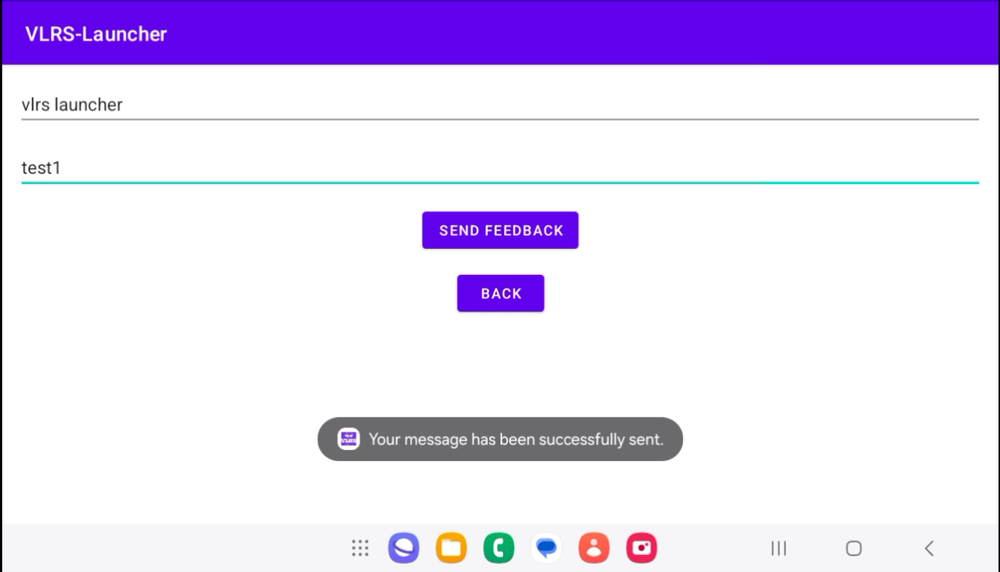

# BusFlow

BusFlow is an Android application designed to replace printed duty sheets by presenting each driver’s roster in an intuitive multi-color timeline or paginated table view. It highlights timing points, tracks on-time performance, and provides a live map to show your route, current position, and nearby buses.

---

## Table of Contents

- [Why BusFlow?](#why-busflow)  
- [Key Features](#key-features)  
- [Screenshots](#screenshots)  
- [Architecture & Modules](#architecture--modules)  
- [Getting Started](#getting-started)  
  - [Prerequisites](#prerequisites)  
  - [Installation](#installation)  
  - [Launcher](#launcher)  
  - [Additional Requirements](#additional-requirements)  
- [Usage](#usage)  
- [Contributing](#contributing)  
- [License](#license)  

---

## Why BusFlow?

Printed duty sheets can be hard to read on the go, and memorizing multiple timing points adds cognitive load. BusFlow:

- **Replaces paper rosters** with a digital schedule that’s crystal-clear at a glance  
- **Visualizes duties** in color-coded timelines or a scrollable table  
- **Highlights timing points** so you know instantly if you’re early, on time, or running late  
- **Provides a live map** for real-time position, route guidance, and tracking other buses  

---

## Key Features

- **Multi-Color Timeline**  
  Displays duties, breaks, and relief periods as proportional, color-coded segments.

- **Paginated Table View**  
  Switch to a concise, paginated table for drivers who prefer row-and-column layouts.

- **Real-Time Schedule Adherence**  
  MapActivity shows “Ahead”, “On Time”, or “Behind” icons at each timing point.

- **Live Map Tracking**  
  Uses Mapsforge + MQTT to plot your bus marker, route polyline, timing-point markers, and other buses on the same route.

- **Offline Fallback**  
  Automatically loads an offline map asset if connectivity drops, with an on-screen notice when other-bus tracking is unavailable.

- **Centralized Configuration**  
  Fetch device-specific settings and today’s roster from a ThingsBoard IoT server via MQTT/REST.

---

## Screenshots

### Launcher Screen  
  
*Tap any of the following to launch a sub-app or feature:*

- **Generate AT Route**  
  

- **Create Route App**  
  

- **Create Schedule App**  
  

- **Customer Service**  
  

### Multi-Color Timeline View  
  

### Live Map & Schedule Status  
  

---

## Architecture & Modules

- **Activities**  
  - `LauncherActivity` – entry point that launches BusFlow main app and utilities  
  - `ScheduleActivity` – timeline/table roster UI  
  - `MapActivity` – live map, timing-point status, arrival confirmation  
  - `TimeTableActivity` – select AID and load schedule data

- **Helpers & Managers**  
  - `MapViewController` – Mapsforge integration (polylines, markers, detection zones)  
  - `MqttHelper` & `MqttManager` – telemetry & configuration via MQTT  
  - `ScheduleStatusManager` – computes Ahead/On-Time/Behind  
  - `LocationManager` – fused-location wrapper  
  - `NetworkStatusHelper` – monitors connectivity & toggles offline UI

- **Data Models**  
  `BusRoute`, `RouteData`, `BusStop`, `BusStopWithTimingPoint`, `BusItem`, `ScheduleItem`, `AttributesData`

- **Services & APIs**  
  Retrofit interfaces plus GSON under `ApiService` / `ApiServiceBuilder`

- **UI & Resources**  
  Layout XML in `res/layout/`; vector drawables; offline map in `app/src/main/assets/`

---

## Getting Started

### Prerequisites

- Android Studio (Arctic Fox or later)  
- JDK 11+  
- Android API Level 21+  
- Internet & Location permissions in `AndroidManifest.xml`:
  ```xml
  <uses-permission android:name="android.permission.INTERNET"/>
  <uses-permission android:name="android.permission.ACCESS_FINE_LOCATION"/>
