# BusFlow: Schedule Stabilization Report

Date: 2026-09-30
Branch: `jchris_time-table-app` (base commit `4b7d3dd`). None of the changes were committed at the time of writing.
Scope: per `CLAUDE.md`, namely (1) Schedule Crash Stabilization and (2) Schedule Accuracy & Adherence.

> **Evidence note:** screenshots were taken on an **Android tablet emulator** (AVD `busflow_tablet`, Android 35, 2560×1600) running a debug build from this repo. The emulator was connected to ThingsBoard Cloud as **Bus B** with the real payload. No physical tablet was connected to the PC during this session, so **there is no evidence from a physical tablet yet**; it still needs to be captured during the live test.

---

## 1. Summary

| Area | Status |
|---|---|
| Crashes and invalid state in the schedule flow | Fixed, tested on the emulator with real Bus B data |
| Single source for Ahead / On Time / Behind status | Fixed. Text, icon, color, zone, and log all come from one result |
| Next run / "1200+ mins" | Fixed |
| ETA and timing points | Fixed. Distance is measured along the route, the fallback speed is consistent, and results can be explained from the log |
| ANR (app freeze) caused by MQTT | Found during emulator testing, then fixed |
| Unit tests | 29/29 passing (18 adherence, 5 route matcher including the real ThingsBoard payload, 5 existing tests, 1 example) |
| Field live test with real GPS on a physical tablet | **Not done yet** |

---

## 2. What was fixed

### 2.1 Crashes and schedule state

| # | Problem (before) | Root cause | Fix | Files |
|---|---|---|---|---|
| C1 | Completed trips reappeared after Fetch Roster | Admin polling every 5 seconds overwrote `activeScheduleData` with the full roster from the server | The server roster is accepted only once per Schedule session (`hasLoadedServerRoster`). The definition: **Fetch Roster = a fresh snapshot. While a shift is running, local progress is not overwritten by polling.** This is a deliberate design decision. | `ScheduleActivity.kt`, `ScheduleViewModel.kt` |
| C2 | Items were lost if the flow was cancelled (Back, missing token, early exit) or the app died mid-trip | The item was removed and the cache written **before** the driver committed | Launch only *stages* the removal. The cache is written when the flow finishes (`RESULT_OK`). On cancel, the list is restored (`scheduleBeforeLaunch`). | `ScheduleActivity.kt` |
| C3 | A trip finished, then the process died before `RESULT_OK` arrived, so the trip repeated | Side effect of C2 | Map, REP, Break, and Signing write the cache themselves the moment the item completes (`ScheduleCache.commitRemaining`). Map and REP write it when the "Trip Completed" dialog appears. | `ScheduleCache.kt` (new), `MapActivity.kt`, `RepActivity.kt`, `BreakActivity.kt`, `TestBreakActivity.kt`, `SigningActivity.kt` |
| C4 | REP was given the wrong route (the Sign On placeholder) | `busRouteData` is index-aligned with the roster. The depot→depot REP and the Sign On placeholder share the same terminals, and the matcher took the first one. | Matcher moved to `RouteMatcher` (pure, testable). The route at the roster item's position is preferred. For an already-trimmed roster (cache mode), positions are aligned from the end. | `RouteMatcher.kt` (new), `ScheduleActivity.kt` |
| C5 | Route did not match, but the app silently used the first route | `firstOrNull()` fallback | Launch is blocked, a toast is shown, and it is logged. Never falls back to another route. | `ScheduleActivity.kt` |
| C6 | Possible crashes from `first()`, `!!`, or `toInt()` on empty or malformed data | Unguarded access | Replaced with `firstOrNull()`, `toIntOrNull()`, and `?: return` | `MapActivity.kt`, `RepActivity.kt`, `ScheduleStatusManager.kt`, `RepScheduleStatusManager.kt`, `MapViewModel.kt`, `RepViewModel.kt` |
| C7 | **ANR:** app froze when the MQTT connection dropped (found on the emulator) | `MqttManager.subscribe()` had no try/catch, so "Connection lost" was thrown on the main thread. The main thread died and `App.kt` swallowed the exception, leaving the UI frozen. | `subscribe` is guarded. `App.kt` no longer swallows MQTT errors on the main thread. | `MqttManager.kt`, `App.kt` |
| C8 | **ANR:** `publish` blocked the main thread for more than 5 seconds (found on the emulator) | `ClientAttributesService` called the synchronous `MqttClient.publish` from the main thread | Publish and subscribe calls made from the main thread now run on a background thread. `timeToWait` = 3 seconds. | `MqttManager.kt` |
| C9 | **MQTT "rate limit": sessions kicking each other off** (found while retesting the client branch at `c0230d1`) | ThingsBoard allows only one MQTT session per device token. `ClientAttributesService` and `ScheduleActivity` (then Map/REP) opened clients with the same Bus token at the same time, so they disconnected each other every 1–2 seconds. The client's fix in `c0230d1` was correct but not sufficient (225 disconnects in 6 minutes). | The service only connects to publish, then disconnects. Schedule releases its client in `onStop` and reconnects in `onRestart`. `disconnect()` now really stops a client that is mid auto-reconnect. Result: **0 disconnects** (previously 224–225). | `ClientAttributesService.kt`, `ScheduleActivity.kt`, `MqttManager.kt` |

### 2.2 Schedule accuracy

| # | Problem (before) | Fix | Files |
|---|---|---|---|
| A1 | Duplicate thresholds. Internally `>0 / -300 / -600`, in the UI `±30 / -300`. Example: +15 seconds was EARLY internally but "On Time" in the UI. Zone color did not match the text. | A single `ScheduleAdherence` module: `calculateScheduleStatus()` and the threshold constants in one place. Text, icon, color, zone/marker, and log use the same result. Map and REP share the same code. | `ScheduleAdherence.kt` (new), `ScheduleStatusManager.kt`, `RepScheduleStatusManager.kt` |
| A2 | Status flickered due to GPS noise | 10-second hysteresis at status boundaries (`STATUS_HYSTERESIS_SECONDS`) | `ScheduleAdherence.kt` |
| A3 | Next run used `list[1]`, but `FULL_SCHEDULE_DATA` sometimes contains the active trip and sometimes does not. As a result the countdown and "Late for next run" pointed to the wrong run, and the "last run" dialog appeared while one run was still left. | `nextRunAfterActive()` selects the next run explicitly | `ScheduleAdherence.kt`, `TimeManager.kt`, `MapActivity.kt`, `RepActivity.kt`, `ScheduleStatusManager.kt` |
| A4 | "Next run in 1250 mins" and "Late by 1200+ mins" appeared | Times are no longer shifted to tomorrow. A difference of more than 4 hours is treated as stale data and shown as "Next run at HH:mm". The -86400-second range override was removed. | `ScheduleAdherence.kt` |
| A5 | The "Late for next run" formula jumped (slack +10 seconds became "late 10s", -10 seconds became "late 310s") | The formula is now the shortfall against the minimum layover: `NEXT_RUN_MIN_LAYOVER_SECONDS - slack`. The 300-second value comes from the old code. | `ScheduleAdherence.kt`, `ScheduleStatusManager.kt` |
| A6 | Multiple clocks were mixed, and midnight was not handled | All calculations use one clock (`getScheduleStatusNowMillis`, simulated in Test*). Times are parsed relative to that clock and are safe across midnight. Malformed input is skipped instead of silently replaced with "now". | `ScheduleAdherence.kt`, `MapViewModel.kt`, `RepViewModel.kt` |
| A7 | **ETA used straight-line distance** to the timing point (found on the emulator). On winding routes the distance actually increased as the bus got closer, so the UI wrongly showed "Early 7 min". | Remaining distance is measured **along the route polyline**. Straight line is only used as a fallback. | `ScheduleStatusManager.kt`, `RepScheduleStatusManager.kt` |
| A8 | Fallback speed = distance to the timing point divided by the time of **one full trip**, making it too slow | Fallback speed = distance to the timing point divided by the scheduled time to that same timing point. `speedSource` is logged. | same as A7 |
| A9 | Logs were not enough to explain the status | One `ScheduleAdherence` log line per calculation: scheduled, now, lat/lon, distanceRemainingM, straightLineM, routeDistanceM, scheduledTravelSec, smoothed/effective speed, speedSource, predictedArrival, deltaSec, status. Tokens are not logged. | same as A7 |

Dead code removed because its semantics were wrong: `getNextScheduleStartTime`, `getDeltaNextSec`, and `getNextTripFormattedLabel`.

---

## 3. Validation

### 3.1 Unit tests (JDK 17, `./gradlew :app:testDebugUnitTest`)

| Suite | Result | Coverage |
|---|---|---|
| `ScheduleAdherenceTest` | 18/18 | CLAUDE.md §18A cases (Ahead +120, On Time -10, Behind -180), threshold boundaries, hysteresis, midnight, malformed input, next run (active trip included/excluded, last trip, Break), countdown with no impossible values, speed source |
| `RouteMatcherTest` | 5/5 | REP vs Sign On placeholder, trimmed roster, no match = -1, **real ThingsBoard payload for Bus A + Bus B: all 27 Trip/REP launches get the correct route** at every roster position |
| `MapActivityTest` (existing) | 5/5 | No regressions |
| `ExampleUnitTest` | 1/1 | |

The real-payload test requires `BUSFLOW_ROUTE_FIXTURE=E:/Projects/BusFlow-testdata/route_fixture.json`. This file is kept outside the repo and contains only terminal coordinates, no tokens.

### 3.2 Emulator tests (debug build, real ThingsBoard Cloud, as Bus B)

| Scenario | Result | Evidence |
|---|---|---|
| Fetch Roster Bus B | 20 items shown | `01-fetch-roster-busB-20-items.png` |
| Sign On, Done, then wait 15 seconds (polling) | List starts from REP 06:29 and is not reset | log `SigningActivity: Committed schedule cache ... next=REP` |
| Force-stop, then Use Cache | Starts from REP 06:29, Sign On does not repeat | log and `ui` dump output |
| Process killed in the middle of REP | Reopened, REP 06:29 still on top and the app automatically enters Schedule (TripLog) | log |
| **Process killed while the "Trip Completed" dialog is showing** | Reopened, list starts from 50A 06:50 and REP does not repeat | log `RepActivity: Committed schedule cache ... next=50A-217` |
| Route for REP 06:29 | `selectedIdx=1` (previously 0, the Sign On placeholder) | log `START_ROUTE` |
| Trip 50A completed | Back to Schedule with 50B first in the list | `05-schedule-after-50A-completed.png` |
| Start of trip 50B, speed 0 | On Time, `SCHEDULE_AVERAGE_FALLBACK`, `deltaSec=-9` | `07-map-start-ontime-fallback.png`, `07-log.txt` |
| 40 km/h, delta +39 | Stays On Time due to hysteresis (needs more than 40) | `08-map-ontime-hysteresis.png`, `08-log-hysteresis.txt` |
| 20 km/h | "Slightly Behind (~1 min late)" in blue, `deltaSec=-98` | `09-map-slightly-behind.png`, `09-log.txt` |
| 50B 07:30 completed, dialog shown | "Trip Completed" dialog: next trip 08:06, 20-minute break. Cache already committed when the dialog appears. | `10-trip-completed-dialog.png`, `10-log.txt` |
| **Process killed while the dialog is showing, then reopened** | List starts from 50B 08:06. The 07:30 trip **does not repeat**. | `11-killed-during-dialog-reopen-no-repeat.png` |
| ETA before and after the distance fix | Before: straight line, "Early ~7 min". After: along the route, "Early ~4 min", matching the calculation | `before-fix-straight-line-early-7min.png`, `after-fix-along-route-early-4min.png` |
| ANR before and after the MQTT fix | Before: "isn't responding". After: 0 ANRs over more than 90 seconds of simulation | `before-fix-ANR-mqtt.png` |

**Traceable example numbers** (`09-log.txt`):

```
scheduled=07:34:00 now=07:31:19 distanceRemainingM=1437 effectiveSpeedKmh=20.0
speedSource=GPS predictedArrival=07:35:38 deltaSec=-98 status=SLIGHTLY_BEHIND
```

The calculation: 1437 m / 5.56 m/s = 259 seconds, so 07:31:19 + 4:19 = 07:35:38. Delta = 07:34:00 - 07:35:38 = -98 seconds, which falls in the -30 to -300 range, so **Slightly Behind**, matching what the UI shows.

To view the log during a live test:

```bash
adb logcat -s ScheduleAdherence
```

---

### 3.3 Evidence screenshots (tablet emulator, build from this repo, Bus B)

**Fetch Roster: 20 Bus B schedule items from ThingsBoard**
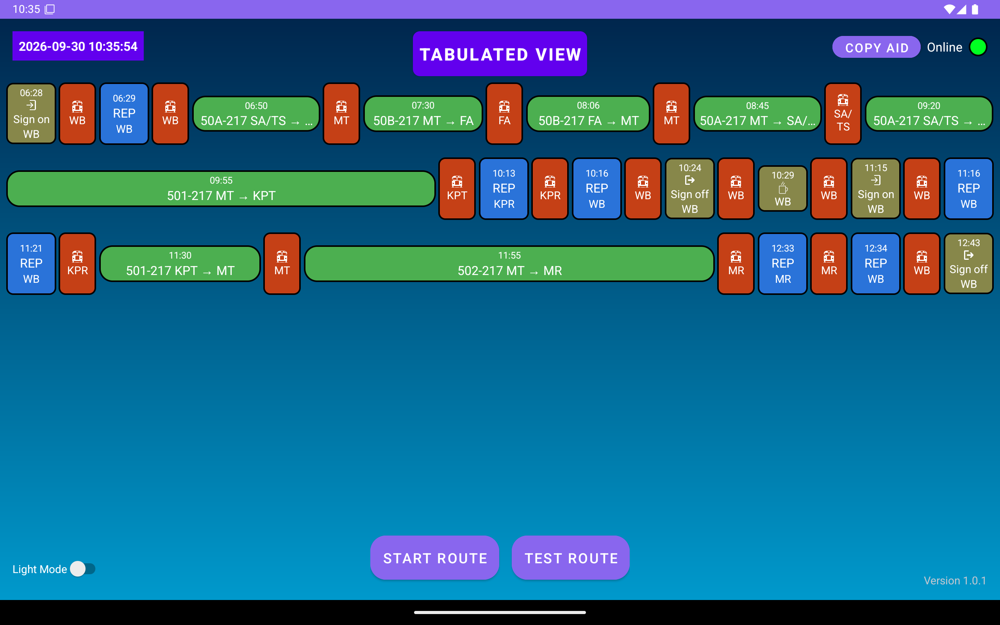

**Signing (Sign On). After Done, the cache is committed and the list moves on to REP**
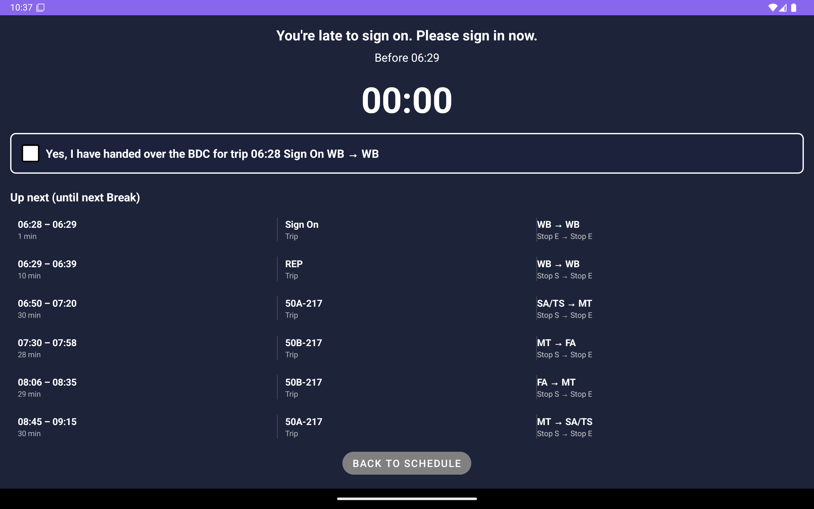

**After 50A completes: back to Schedule with 50B 07:30 first in the list**
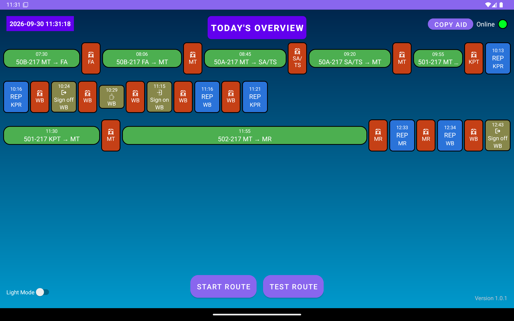

**Confirmation for 50B, route matched via RouteMatcher**
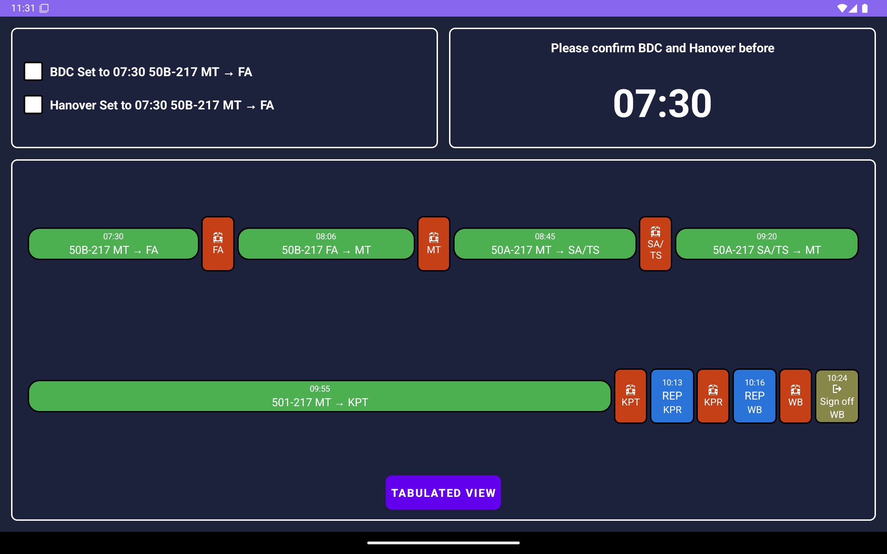

**Start of trip, speed 0: On Time, `SCHEDULE_AVERAGE_FALLBACK`, `deltaSec=-9`**
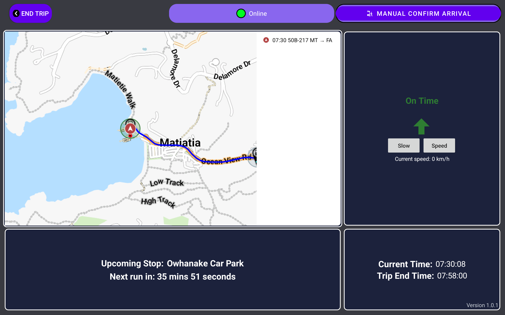

**40 km/h, delta +39: stays On Time due to hysteresis**
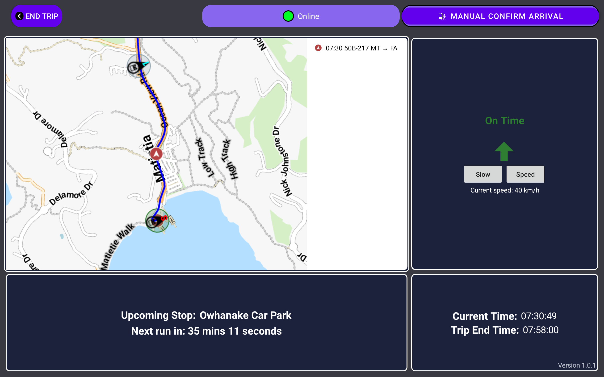

**20 km/h: "Slightly Behind (~1 min late)", `deltaSec=-98`**
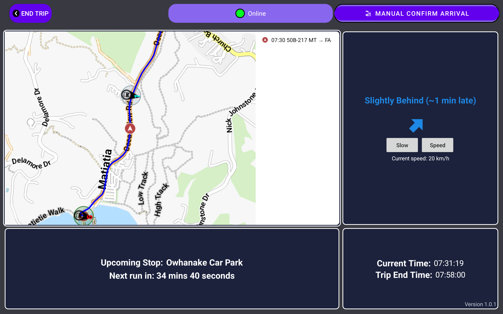

**"Trip Completed" dialog: next trip 08:06, cache committed when the dialog appears**
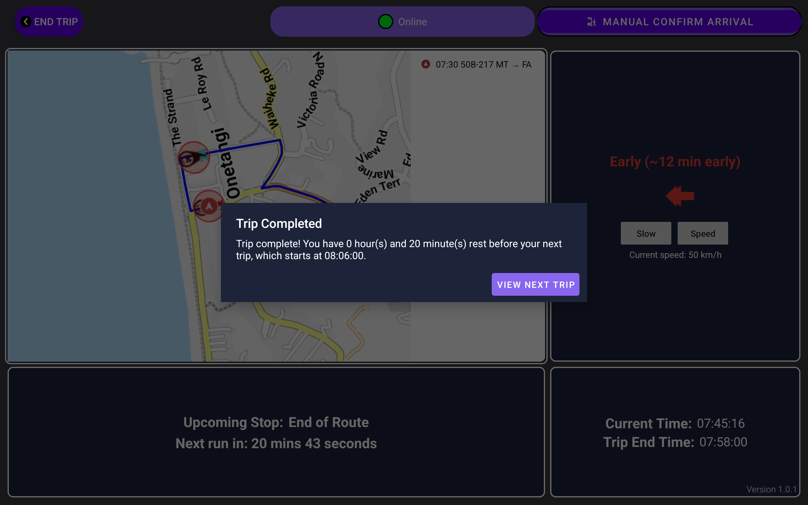

**Process killed during the dialog, then reopened: list starts from 08:06, the 07:30 trip does not repeat**
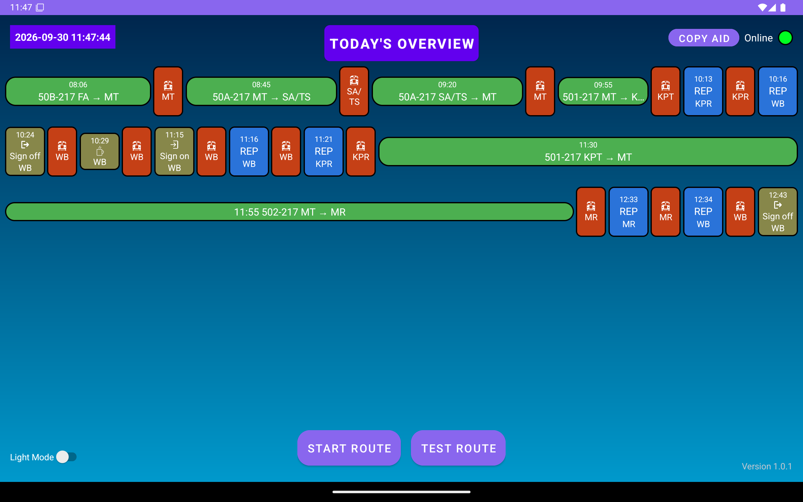

**Before the fix: straight-line distance, "Early ~7 min"**
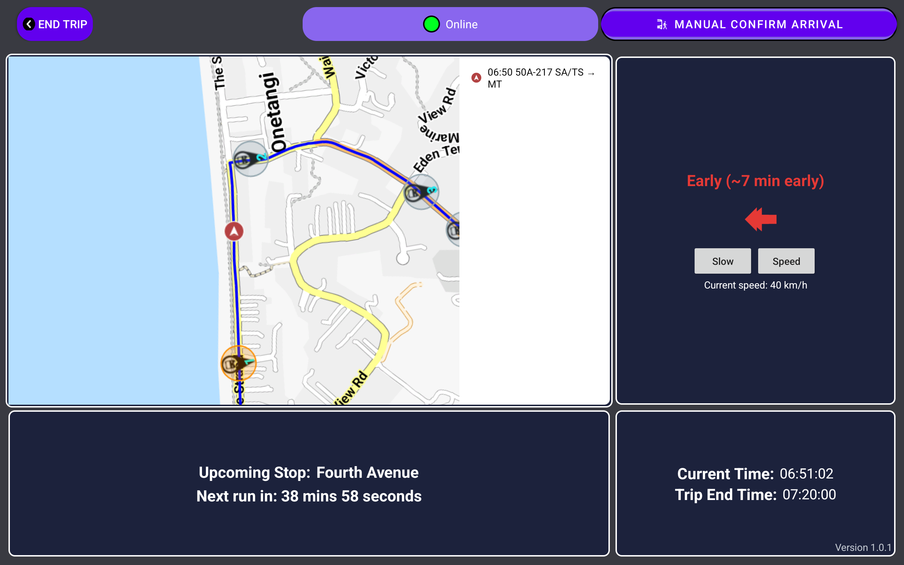

**After the fix: distance along the route, "Early ~4 min"**
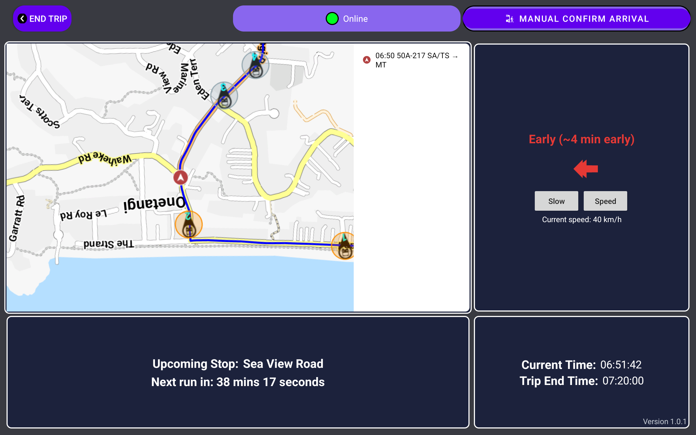

**Before the fix: ANR when the MQTT connection drops**
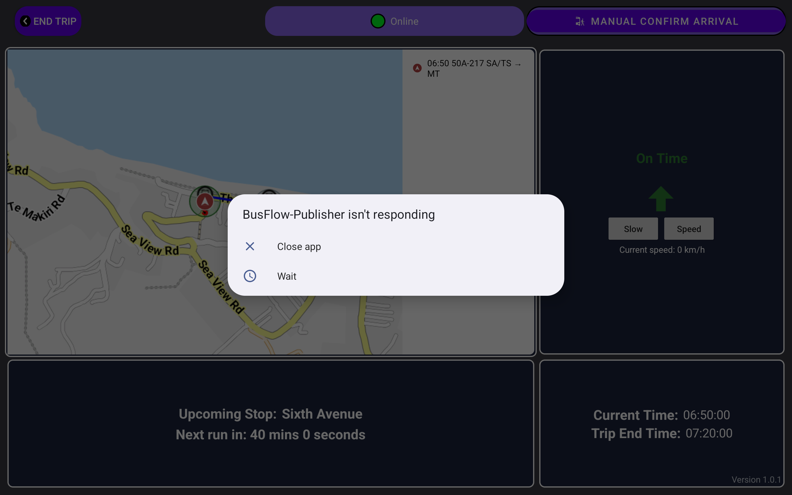

---

## 4. Decisions that need client confirmation

1. **Meaning of the zone colors.** Green = On Time, red = Early, **blue = Slightly Behind (30 seconds to 5 minutes)**, purple = Very Behind (more than 5 minutes). Previously the UI text already used blue for 30 seconds to 5 minutes late, but the marker/zone used blue for 5 minutes or more late. Do these colors carry a specific operational meaning? If so, only the constants in `ScheduleAdherence` need to change.
2. **5-minute minimum layover** (`NEXT_RUN_MIN_LAYOVER_SECONDS = 300`). The value was taken from the old code. Is this one of their operational rules?
3. **On Time tolerance of ±30 seconds.** This comes from the old UI code. If the client uses, for example, ±120 seconds, change it in one place.
4. **Schedule updates mid-shift** require another Fetch Roster (a consequence of C1).

---

## 5. Remaining risks

- **MQTT disconnect/reconnect loop: fixed (C9).** The cause was several clients with the same device token disconnecting each other's sessions. Result on the emulator: 0 disconnects. Still needs confirming on a physical tablet.
- **No live test with real GPS on a physical tablet yet.** Real GPS noise, hardware accuracy, and OEM behavior are untested.
- If the client changes the roster, the real-payload test (`RouteMatcherTest`) needs to be rerun with the new data.
- Cancelling via the Confirmation screen cannot be tested on the emulator, because a single checkbox launches immediately and Back is blocked before anything is checked. The restore logic exists but is not tested end to end.
- Distance along the route uses the nearest route point with a search window. If the GPS jumps far, the estimate can be briefly wrong until the window catches up.
- Not yet tested: trips that cross midnight on a device (covered by unit tests), and the Very Behind status on a device (covered by unit tests).

## 6. Deferred (out of scope, not changed)

- The Config Data token is hardcoded as a default in `MqttManager.kt`. This is a security risk.
- `vlrskey.jks` (keystore) is committed at the repo root.
- The screen recording permission dialog on Splash can leave Splash hanging if reopened in the same process.
- `RepActivity` replaces the global uncaught exception handler with one that immediately kills the process.
- Duplicated code between Map and REP (`ScheduleStatusManager` / `RepScheduleStatusManager`, and their activities). Changes were applied identically to both, not refactored.

---

## 7. What was done (chronological)

1. Read `CLAUDE.md`, cloned the repo, and inspected ThingsBoard read-only. Result: `config` is consistent across Config Data, Bus A, and Bus B, and the tokens match the device credentials.
2. Audited the schedule code (subagent) and analyzed the status, next run, and time calculations.
3. Implemented `ScheduleAdherence` and refactored Map/REP to use the same status source.
4. State fixes: polling guard, stage/commit/restore on launch, and route guard.
5. Installed JDK 17 locally (`E:\Development\jdk17`). Build and unit tests.
6. Validated the route matcher with the real Bus A/B payload. Found and fixed the REP → Sign On placeholder bug.
7. Fixed the "completed, then process died" edge case (`ScheduleCache`).
8. Created a tablet emulator. The emulator ran as Bus B (`aid.txt` filled with the already-registered Bus B AID, **without editing the ThingsBoard config**).
9. End-to-end testing on the emulator. Found and fixed 2 MQTT ANRs and the straight-line ETA bug.
10. Captured screenshot and log evidence, then wrote this report.

## 8. Next steps

1. Client confirmation for the points in §4.
2. Commit to a new branch (for example `fix/schedule-stabilization`), one commit per logical change.
3. Install the APK on a physical tablet, get the AID (`adb shell cat /sdcard/Documents/.vlrshiddenfolder/aid.txt`), then set the Bus B AID in the `config` of all three devices (requires approval because it changes production data).
4. Live test with real GPS while recording `adb logcat -s ScheduleAdherence`, then match the status in the UI against the numbers in the log.
